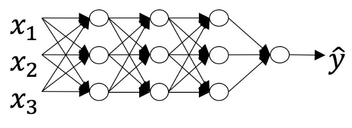

# General forward propagation

- First layer: $z^{[1]} = w^{[1]} * x + b^{[1]}$
- Subsequent layers: $z^{[l]} = w^{[l]} * a^{[l-1]} + b^{[l]}$

# General backward propagation

- Final gradient: $dz^{[L]} = \frac{\delta L}{\delta z^L} = \frac{\delta L}{\delta a^L} \frac{\delta a^L}{\delta z^L}$

- Previous layers:
  - $dz^{[l]} = \frac{\delta L}{\delta z^n} = \frac{\delta L}{\delta z^{l+1}} \frac{\delta z^{l+1}}{\delta a^{l}} \frac{\delta a^l}{\delta z^l} = \frac{\delta L}{\delta z^{l+1}} * w^l * \frac{\delta a^l}{\delta z^l}$
  - $dw^{[l]} = \frac{\delta L}{\delta w^l} = \frac{\delta L}{\delta z^l} \frac{\delta z^l}{\delta w^l}$
  - $db^{[l]} = \frac{\delta L}{\delta b^{[l]}} = dz^{[l]}$

- Gradient adjustment:
  - $w^{[l]} = w^{[l]} - \alpha * dw^{[l]}$
  - $b^{[l]} = b^{[l]} - \alpha * db^{[l]}$


# Dimension

- Weight $\rightarrow$ $w^{[l]}: (n^{[l]}, n^{[l-1]})$, where n is the number of nodes in a layer.
- Bias $\rightarrow$ $b^{[l]}: (n^{[l]}, 1)$

# Hyper-parameters

Tuning hyper-parameters is an emperical process. Plot the cost J against various values of each hyper-parameter and look for the ideal value.

- Learning rate
- Number of iterations
- Number of hidden layers
- Number of hidden units in a layer
- Choice of activation function

# Questions

1. What is the "cache" used for in our implementation of forward propagation and backward propagation?
- We use it to pass variables computed during forward propagation to the corresponding backward propagation step. It contains useful values for backward propagation to compute derivatives.

2. Among the following, which ones are "hyperparameters"? (Check all that apply.)
  - size of the hidden layers
  - learning rate
  - number of iterations
  - number of layers L in the neural network

3. Which of the following statements is true?
  - The deeper layers of a neural network are typically computing more complex features of the input than the earlier layers.

4. Vectorization allows you to compute forward propagation in an L-layer neural network without an explicit for-loop (or any other explicit iterative loop) over the layers l=1, 2, …,L. True/False?
  - False.
  - Forward propagation propagates the input through the layers.  Although for shallow networks we may just write all the lines
    - $a^{[2]}=g^{[2]}(z^{[2]}), z^{[2]}=W^{[2]}a^{[1]}+b^{[2]}, ...$
  - in a deeper network, we cannot avoid a for loop iterating over the layers:
    - $a^{[l]}=g^{[l]}(z^{[l]}),  z^{[l]}=W^{[l]}a^{[l-1]} + b^{[l]} ...$.

5. Assume we store the values for n[l] in an array called layers, as follows: layer_dims = $[n_x, 4,3,2,1]$. So layer 1 has four hidden units, layer 2 has 3 hidden units and so on. Which of the following for-loops will allow you to initialize the parameters for the model?
    ```python
    for(i in range(1, len(layer_dims))):
    parameter[‘W’ + str(i)] = np.random.randn(layers[i], layers[i-1])) * 0.01
    parameter[‘b’ + str(i)] = np.random.randn(layers[i], 1) * 0.01
    ```

6. Consider the following neural network. How many layers does this network have?

<center></center>

  - The number of layers L is 4. The number of hidden layers is 3.

7. During forward propagation, in the forward function for a layer l you need to know what is the activation function in a layer (Sigmoid, tanh, ReLU, etc.). During backpropagation, the corresponding backward function also needs to know what is the activation function for layer l, since the gradient depends on it. True/False?

  - True. Each activation has a different derivative. Thus, during back-propagation you need to know which activation was used in the forward propagation to be able to compute the correct derivative.

8. There are certain functions with the following properties: To compute the function using a shallow network circuit, you will need a large network (where we measure size by the number of logic gates in the network) but To compute it using a deep network circuit, you need only an exponentially smaller network. True/False?

  - True

9. Consider the following 2 hidden layer neural network:

<center></center>

Which of the following statements are True? (Check all that apply).

  - $W^{[1]}$ will have shape (4, 4)
  - $b^{[1]}$ will have shape (4, 1)
  - $W^{[2]}$ will have shape (3, 4)
  - $b^{[2]}$ will have shape (3, 1)
  - $W^{[3]}$ will have shape (1, 3)
  - $b^{[3]}$ will have shape (1, 1)

10. Whereas the previous question used a specific network, in the general case what is the dimension of $W^{[l]}$, the weight matrix associated with layer $l$

  - $W^{[l]}$ has shape ($n^{[l]},n^{[l-1]}$)
